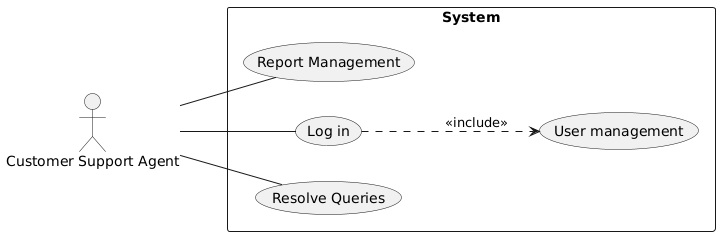
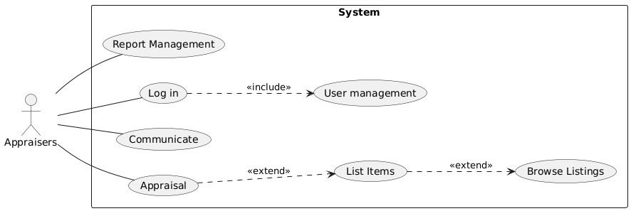

# Vintage Timepiece Evaluation and Trading Platform

## I. Tổng quan dự án

### Mục tiêu

Mục tiêu của dự án là xây dựng một website mua bán đồng hồ cũ, giúp nguời dùng giao dịch đồng hồ cổ một cách chuyên nghiệp, an toàn và minh bạch. Hệ thống phục vụ nhiều đối tượng khác nhau như người bán, người mua, chuyên gia thẩm định, quản trị viên và nhân viên hỗ trợ.

### Phạm vi

Phạm vi dự án bao gồm các chức năng chính : đăng và quản lý sản phẩm, tìm kiếm và mua hàng, thẩm định đồng hồ, quản lý tài khoản và giao dịch, xử lý tranh chấp, hỗ trợ khách hàng, quản trị hệ thống và bảo mật.

### Giả định và ràng buộc   

Hệ thống phục vụ cho việc giao dịch đồng hồ cũ, không phải là một sàn thương mại điện tử tổng hợp.

Hệ thống chỉ hỗ trợ mua bán, thẩm định và thanh toán, không bao gồm các dịch vụ tài chính khác (ví dụ: cho vay, trả góp).

Hệ thống chỉ tập trung vào đồng hồ cổ và đồng hồ chính hãng, không hỗ trợ các mặt hàng khác.

Hệ thống hỗ trợ giao dịch trực tuyến, nhưng không trực tiếp chịu trách nhiệm về quá trình vận chuyển hàng hóa.

Hệ thống yêu cầu người dùng cung cấp thông tin chính xác (sản phẩm, giao dịch, tài khoản), ban quản trị không chịu trách nhiệm nếu người dùng cố tình khai báo sai.

## II. Yêu cầu chức năng

### Các tác nhân

- Hệ thống có 5 tác nhân chính:Customer Support Agents,Administrators,Appraisers,Buyers,Sellers.

Code PlantUML
 UC1
Buyer --> UC3

Seller --> UC1
Seller --> UC2

Appraiser --> UC4

CSA --> UC5

Admin --> UC6
@enduml>

## Các chức năng chính

***Sellers:***

- Đăng sản phẩm: Cho phép người bán thêm thông tin sản phẩm gồm hình ảnh, mô tả, năm sản xuất, hãng, tình trạng, giá.

- Gửi thẩm định: Gửi yêu cầu đến chuyên gia để xác thực đồng hồ.

- Chỉnh sửa sản phẩm: Cập nhật thông tin hoặc giá bán dựa trên báo cáo thẩm định.

- Quản lý sản phẩm: Xem, sửa, hoặc xóa sản phẩm đã đăng.

- Xem trạng thái giao dịch: Theo dõi tình hình đơn hàng và phản hồi của người mua.

***Buyer:***

- Tìm kiếm sản phẩm: Lọc theo hãng, giá, tình trạng, năm sản xuất.

- Xem chi tiết sản phẩm: Hiển thị mô tả, hình ảnh, thông tin người bán.

- Xem báo cáo thẩm định: Kiểm tra tính xác thực và giá trị đồng hồ trước khi mua.

- Mua sản phẩm: Thực hiện thanh toán qua hệ thống.

- Xác nhận giao hàng: Hoàn tất giao dịch sau khi nhận hàng.

- Đánh giá: Đưa ra nhận xét về sản phẩm và người bán.

***Appraisers:***

- Xem yêu cầu thẩm định: Truy cập danh sách sản phẩm cần kiểm định.

- Đánh giá sản phẩm: Kiểm tra độ nguyên bản, tình trạng, độ hiếm, lịch sử sản phẩm.

- Tạo báo cáo: Gửi báo cáo thẩm định gồm tính xác thực, giá trị thị trường, đề xuất giá.

***Admin:***

- Quản lý tài khoản: Phê duyệt chuyên gia, quản lý người bán và người mua.

- Quản lý sản phẩm: Kiểm tra, tạm khóa hoặc gỡ sản phẩm khi phát hiện bất thường.

- Xử lý tranh chấp: Giải quyết khi có vấn đề giữa người mua và người bán.

- Quản lý hệ thống: Kiểm tra nhật ký, cập nhật phần mềm, đảm bảo an toàn dữ liệu.

***Customer Support Agents:***

- Tiếp nhận yêu cầu: Nhận thắc mắc và sự cố từ người dùng.

- Hỗ trợ trực tiếp: Trả lời câu hỏi, hướng dẫn sử dụng hệ thống.

- Chuyển tiếp sự cố: Gửi cho bộ phận liên quan khi cần xử lý kỹ thuật.

- Ghi nhận phản hồi: Thu thập ý kiến cải tiến dịch vụ

## Biểu đồ Use Case

Code PlantUML
 UC_Browse
Buyers --> UC_List
Buyers --> UC_Login
Buyers --> UC_Transactions
Buyers --> UC_Communicate

Sellers --> UC_List
Sellers --> UC_Login
Sellers --> UC_Transactions
Sellers --> UC_Communicate
Sellers --> UC_Manage

Appraisers --> UC_Appraisal

CSA --> UC_Resolve

Administrator --> UC_UserMgmt
Administrator --> UC_Security
Administrator --> UC_Update

' --- Includes / Extends ---
UC_Transactions --> UC_Escrow : <<include>>
UC_Report ..> UC_Transactions : <<extend>>

@enduml

### Biểu đồ Use Case chi tiết

#### Chức năng Seller

Code PlantUML
 UC1
Seller --> UC2
Seller --> UC4
Seller --> UC7
Seller --> UC8
Seller --> UC10

UC2 --> UC3 : <<include>>
UC4 --> UC5 : <<extend>>
UC4 --> UC6 : <<extend>>
UC8 --> UC9 : <<include>>

@enduml

#### Chức năng buyers

Code PlantUML
 UC1
Buyers --> UC2
Buyers --> UC4
Buyers --> UC7

UC2 --> UC3 : <<include>>
UC2 --> UC5 : <<extend>>
UC4 --> UC6 : <<extend>>
UC7 --> UC8 : <<include>>

#### Chức năng Customer supports Agent

Code PlantUML
 UC1
CSA --> UC2
CSA --> UC4

UC2 --> UC3 : <<include>>

@enduml

#### Chức năng Administrator

Code PlantUML
 UC1
CSA --> UC2
CSA --> UC4

UC2 --> UC3 : <<include>>

@enduml

#### Chức năng Appraisers

Code PlantUML
 UC1
App --> UC2
App --> UC4
App --> UC5

UC2 --> UC3 : <<include>>
UC5 --> UC6 : <<extend>>
UC6 --> UC7 : <<extend>>

@enduml

### Quy trình hoạt động

#### Quy trình mua hàng

Code PlantUML

#### Quy trình bán hàng

Code PlantUML

#### Quy trình thanh toán

Code PlantUML

### Luồng xử lý

#### Luồng xử lý đăng ký

Code PlantUML
 system: Tạo mã xác thực email
system -> ui: Gửi email xác thực
activate ui

ui --> customer: Thông báo đăng ký thành công
ui --> customer: Chuyển đến trang xác thực email
deactivate ui

customer -> ui: Truy cập form đăng ký
customer -> ui: Điền thông tin (họ tên, email, SĐT, mật khẩu)
ui -> system: Gửi thông tin đăng ký
activate system

system -> system: Kiểm tra thông tin

alt Thông tin hợp lệ
    system -> db: Lưu thông tin tài khoản
    activate db
    db --> system: Xác nhận lưu thành công
    deactivate db

system -> system: Tạo mã xác thực email
system -> ui: Gửi email xác thực
activate ui

ui --> customer: Thông báo đăng ký thành công
ui --> customer: Chuyển đến trang xác thực email
deactivate ui

else Thông tin không hợp lệ
    system --> ui: Trả về lỗi
    activate ui
    ui --> customer: Hiển thị thông báo lỗi
    deactivate ui
end

#### Luồng xử lý mua

Code PlantUML
 UI: Chọn sản phẩm
activate UI
UI -> System: Lấy thông tin sản phẩm
activate System
System --> UI: Hiển thị chi tiết sản phẩm
deactivate System
deactivate UI

Buyer -> UI: Thêm vào giỏ hàng
Buyer -> UI: Chọn phương thức thanh toán
activate UI
UI -> System: Gửi yêu cầu đặt hàng
activate System
System -> Seller: Thông báo đơn hàng mới
activate Seller

Seller --> System: Xác nhận đơn hàng
deactivate Seller
System --> UI: Xác nhận đơn hàng thành công
deactivate System

UI --> Buyer: Hiển thị thông tin đơn hàng
deactivate UI

note right of Seller
  Seller sẽ xử lý và gửi hàng sau
end note

@enduml

#### Luồng xử lý POST

Code PlantUML
 UI: 1. Mở form đăng sản phẩm
UI --> Seller: 2. Hiển thị form
Seller -> UI: 3. Nhập thông tin watch + ảnh
UI -> System: 4. Gửi yêu cầu đăng sản phẩm (POST /watches)
System -> DB: 5. Lưu watch vào bảng watches
DB --> System: 6. Trả watch_id
System --> UI: 7. Xác nhận đăng bán thành công
UI --> Seller: 8. Hiển thị thông báo "Đã đăng bán"

@enduml

#### Luồng xử lý Admin

Code PlantUML
 UI: 1. Mở form đăng sản phẩm
UI --> Seller: 2. Hiển thị form
Seller -> UI: 3. Nhập thông tin watch + ảnh
UI -> System: 4. Gửi yêu cầu đăng sản phẩm (POST /watches)
System -> DB: 5. Lưu watch vào bảng watches
DB --> System: 6. Trả watch_id
System --> UI: 7. Xác nhận đăng bán thành công
UI --> Seller: 8. Hiển thị thông báo "Đã đăng bán"

@enduml

#### Luồng xử lý Định giá

Code PlantUML
 UI: 1. Gửi yêu cầu thẩm định cho Watch X
UI -> System: 2. Gửi request thẩm định
System -> Appraiser: 3. Thông báo/assign request tới Appraiser (notification)
Appraiser -> System: 4. Lấy thông tin Watch để thẩm định
Appraiser -> System: 5. Gửi kết quả thẩm định (value, note, status)
System -> DB: 6. Lưu appraisal record
DB --> System: 7. Trả kết quả lưu
System --> UI: 8. Thông báo kết quả thẩm định
UI -> Seller: 9. Cập nhật giá/ghi chú hiển thị

@enduml

#### Luồng xử lý Feedback

Code PlantUML
 UI: 1. Viết feedback cho Seller/Watch
UI -> System: 2. Gửi feedback (POST /feedback)
System -> DB: 3. Lưu feedback (sender, receiver, content, rating)
DB --> System: 4. Trả feedback_id
System --> UI: 5. Xác nhận "Cảm ơn bạn đã đánh giá"
System -> Seller: 6. Thông báo có feedback mới (notification)
Seller -> System: 7. (tùy) Xem/Phản hồi feedback

#### Luồng xử lý payment

Code PlantUML
 UI: 1. Chọn đơn hàng để thanh toán
UI -> System: 2. Gửi yêu cầu thanh toán (order_id)
System -> DB: 3. Kiểm tra đơn hàng (status = Pending)
DB --> System: 4. Trả thông tin đơn hàng
System -> PG: 5. Gửi yêu cầu thanh toán (amount, buyer info)
PG --> System: 6. Xác nhận giao dịch thành công
System -> ES: 7. Tạo tài khoản ký quỹ (escrow record)
ES -> DB: 8. Lưu giao dịch escrow (order_id, amount, status=HOLD)
DB --> ES: 9. OK
ES --> System: 10. Xác nhận lưu ký quỹ
System --> UI: 11. Thông báo "Thanh toán thành công - đang giữ tiền"
UI -> Buyer: 12. Thông báo có đơn hàng đã được thanh toán (đang ký quỹ)
note right of ES
Tiền sẽ được giữ phòng cho Seller
sau khi Buyer xác nhận nhận hàng
hoặc sau thời gian bảo đảm
end note

#### Luồng dữ liệu

Code PlantUML
 OrderManagement: Đăng bán sản phẩm
Appraiser --> AppraisalManagement: Cập nhật kết quả thẩm định
Buyer --> PaymentManagement: Thanh toán
Buyer --> SystemManagement: Đăng ký / Đăng nhập
Admin --> SystemManagement: Đăng ký / Đăng nhập
Admin --> SystemManagement: Quản lý User/Order/Transaction

' ------------------ System Flow ------------------

Seller --> AppraisalManagement: Yêu cầu thẩm định
Appraiser --> AppraisalManagement
AppraisalManagement --> AppraisalsDB: Đọc/Ghi
AppraisalManagement --> OrderManagement: Cập nhật tình trạng đơn hàng

Buyer --> AppraisalManagement: Yêu cầu thẩm định
Buyer --> OrderManagement: Đặt hàng
Seller --> OrderManagement: Xem trạng thái đơn hàng
OrderManagement --> OrdersDB: Đọc/Ghi đơn hàng

Buyer --> PaymentManagement: Thanh toán
PaymentManagement --> TransactionsDB: Ghi transaction
PaymentManagement --> EscrowDB: Tạo Escrow

SystemManagement --> AccountManagement
SystemManagement --> PaymentManagement
SystemManagement --> AppraisalManagement
SystemManagement --> OrderManagement
SystemManagement --> UsersDB: Đọc/Ghi thông tin user

Buyer <-- PaymentManagement: Nhận tiền sau Escrow Released

@enduml

### Các trạng thái thực thể trong hệ thống

Code PlantUML
 Draft

Draft --> PendingEvaluation: Gửi yêu cầu thẩm định
PendingEvaluation --> UnderEvaluation: Chuyên gia nhận kiểm định
UnderEvaluation --> Evaluated: Gửi báo cáo thẩm định
Evaluated --> ListedForSale: Người bán niêm yết sản phẩm
ListedForSale --> Reserved: Người mua đặt hàng + thanh toán
Reserved --> Shipped: Người bán giao hàng
Shipped --> Completed: Người mua xác nhận nhận hàng
Shipped --> Disputed: Khiếu nại
Reserved --> Disputed: Khiếu nại
Disputed --> Completed: Admin xử lý thành công
Disputed --> Cancelled: Admin hủy giao dịch
Reserved --> Cancelled: Hủy giao dịch
ListedForSale --> Cancelled: Người bán hủy niêm yết
Completed --> []
Cancelled --> []
@enduml

## IV. Công nghệ:

* ***Frontend***: Sử dụng ReactJS để xây dựng giao diện người dùng.

* ***Backend:*** Sử dụng python để phát triển các dịch vụ backend.

* ***API:*** Sử dụng chuẩn REST API flask để giao tiếp giữa frontend và backend.

* ***Cơ sở dữ liệu:*** Sử dụng MS SQL để lưu trữ dữ liệu. 

* ***Triển khai:*** Sử dụng Docker để đóng gói và triển khai ứng dụng.

* ***Quản lý mã nguồn:*** Sử dụng Git để quản lý mã nguồn và GitHub để lưu trữ ma nguồn.

## V. Yêu cầu thiết kế

### Mô hình kiến trúc

Mô hình kiến trúc của hệ thống sẽ bao gồm các thành phần sau:

* ***Client:*** Giao diện người dùng, xây dựng bằng ReactJS, kết nối với API để lấy dữ liệu.

* ***Server:*** Dịch vụ API, xây dựng bằng ASP Net Web API  Web API, sử dụng kiến trúc 3 lớp để xử lý    logic.

    * ***Presentation:*** Xử lý các yêu cầu từ client, gọi các phương thức từ lớp Service.

    * ***Business Logic:*** Chứa logic xử lý chính của ứng dụng, gọi các phương thức từ lớp Repository.

    * ***Data Access:*** Tương tác với cơ sở dữ liệu, thực hiện các thao tác CRUD.

* ***Database:*** Cơ sở dữ liệu MS SQL Server, lưu trữ thông tin người dùng, lịch hẹn, dịch vụ...

Code PlantUML
 [Controller] : REST API
[Controller] --> [Service]
[Service] --> [Repository]
[Repository] --> DB
@enduml

### Mô hình cơ sở dữ liệu:

Cơ sở dữ liệu sẽ bao gồm các bảng sau:

Code PlantUML

* ***Users:*** Lưu thông tin người dùng, bao gồm tên, email, mật khẩu, quyền...

* ***Watch:*** id,tên thương hiệu,tên sản phẩm,giá tiền, ngày đăng…

* ***Appraisal:*** tên,ảnh đại diện,độ uy tín,kinh nghiệm….

* ***Order:*** tên sản phẩm,id sản phẩm ,địa chỉ giao ,địa chỉ nhận hàng ,ngày giao nhận,thanh toán bằng …

* ***Escrow:*** id sản phẩm ,giá tiền,số lượng,seller id …

#### Giao diện người dùng

Giao diện người dùng sẽ bao gồm các trang sau:

* ***Trang chủ:*** Hiển thị thông tin sản phẩm , các công cụ tim kiếm , sản phẩm  nổi bật.

* ***Trang seller:*** Hiển thị thông tin người bán, cho phép tìm kiếm và xem chi tiết ,thẩm định sản phẩm.

* ***Trang cá nhân:*** Hiển thị thông tin cá nhân, cho phép cập nhật thông tin, đổi mật khẩu, quản lý giỏ hàng.

* ***Trang Appaiser:*** Hiển thị thông tin sản phẩm,hiển thị độ uy tín của nhà thẩm định,cho phép đưa thẩm định cho sản phẩm.

* ***Trang Admin:*** Hiển thị thông tin người dùng trang,cho phép truy cập vào thông tin cá nhân của người mua và bán,giải quyết tranh chấp giữa người mua và bán.

* ***Trang Customer Support Agent:*** Hiển thị thông tin người mua, hỗ trợ người mua sản phẩm,hỗ trợ hoàn trả và thanh toán sản phẩm.